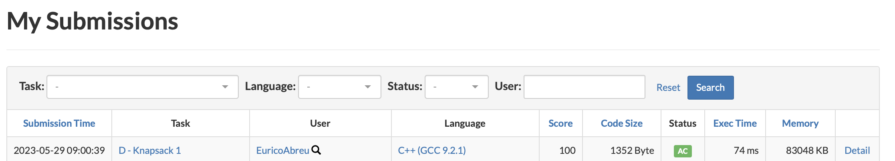

# CP-Problems

**Conteúdo da Disciplina**: Greed 

## Alunos

| Matrícula  | Aluno                        |
| ---------- | ---------------------------- |
| 19/0016663 | Lucas Pimentel Quintão       |
| 20/0017519 | Eurico Menezes de Abreu Neto |

## Sobre

Para este projeto da disciplina optamos por fazer questões de Programação Competitiva de dificuldade difícil, utilizando o site AtCoder.

- [D - Knapsack 1](https://atcoder.jp/contests/dp/tasks/dp_d)

## Screenshots Accepteds

## Instalação

**Linguagem**: C++ 

<code>g++ nomeArquivo.cpp -std=c++11 -o exec</code>

<code>./exec</code>

## Uso

Para testar os exercícios, recomendamos acessar a página do exercício que deseja executar e observar os padrões dos casos de testes disponíveis.

## Vídeo

O vídeo para explicação e demonstração do trabalho pode ser encontrado a partir do seguinte [link](ADD LINK).
