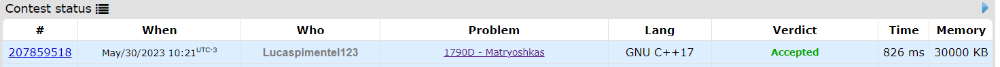
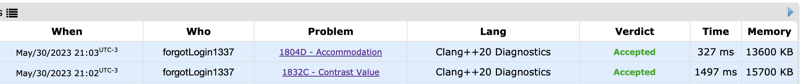

# CP-Problems

**Conteúdo da Disciplina**: Greed 

## Alunos

| Matrícula  | Aluno                        |
| ---------- | ---------------------------- |
| 19/0016663 | Lucas Pimentel Quintão       |
| 20/0017519 | Eurico Menezes de Abreu Neto |

## Sobre

Para este projeto da disciplina optamos por fazer questões de Programação Competitiva de dificuldade difícil, utilizando o site AtCoder e Codeforces.

- [D - Impartial Gifts](https://atcoder.jp/contests/abc302/tasks/abc302_d)
- [D - Matryoshkas](https://codeforces.com/problemset/problem/1790/D)
- [Contrast Value](https://codeforces.com/problemset/problem/1832/C)
- [Accommodation](https://codeforces.com/problemset/problem/1804/D)

## Screenshots Accepteds

## Instalação

**Linguagem**: C++ 

<code>g++ nomeArquivo.cpp -std=c++11 -o exec</code>

<code>./exec</code>

## Uso

Para testar os exercícios, recomendamos acessar a página do exercício que deseja executar e observar os padrões dos casos de testes disponíveis.

## Vídeo

O vídeo para explicação e demonstração do trabalho pode ser encontrado a partir do seguinte [link](https://www.youtube.com/watch?v=Ga0zyizIHt4).

Video sem compressão se encontra na pasta assets

https://github.com/projeto-de-algoritmos/Greed_CP-Problems/assets/64049043/d1d471ef-2e4c-4f8e-aed0-448c685f24f3
